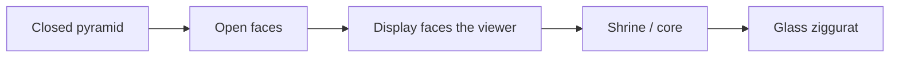

# Azure Capstone

Handmade four-sided pyramid jewelry cabinet, rebuilt as an interactive 3D web showcase.

This is the project document for the physical piece and the site that lets you open it, dress the compartments, and fill the shrine.

## The real cabinet

Azure Capstone is a shop-built square-base pyramid. Four triangular faces are hinged at the base. Each face is a compartment. When they fold in, a frosted-glass ziggurat sits in the middle — the shrine.

| Face | What it holds |
| --- | --- |
| **Pegs** | Wooden dowel spine, washer discs |
| **Coils** | Hand-formed copper rose spirals |
| **Shelves** | Hidden cubbies, unfinished wood |
| **Vials** | Glass tubes on a center rail |

Exterior: teal paint, copper comet darts, copper hinge discs. Interior: mosaic glass tile, copper wire, brass pins. The shrine is stacked diamond terraces of frosted glass with mosaic chips and a gold peak. The cabinet stands on a three-legged wooden tripod with a copper inlay. A dark cat likes the stand.

Workshop photos of the build (framing, mosaic, paint, open/closed, lit shrine) are the source of truth for the 3D model. Inner-face textures are cropped and warped from those shots so the triangle UVs match the real doors.

## Nested open

The physical cabinet does not dump everything at once. Outer doors swing first. Inner displays stay with you. Then those panels fold so the shrine is visible.



In the site:

1. **Open faces** — stagger-bloom of the four outer doors (`OPEN_SWING ≈ 2.4 rad`).
2. Inner photo panels stay in the pyramid plane, facing the camera.
3. **Shrine** — inner panels fold and the glass core lights up.
4. **Close** — reverse stagger, shrine first.

That is the fix for “it opened up with the display on the opposite side.” The outer skin and the inner panel are separate meshes. The door swings away. The display does not flip with it.

## 3D geometry

Square base half-width `S = 1.08`, height `H = 2.52`, face length `L = hypot(H, S)`.

Closed pitch:

```
CLOSED = atan2(-S, H)   ≈ -0.405 rad
```

Each door lives in a group rotated `i · π/2` around Y. Hinge rotation is:

```
rotation.x = CLOSED + amount * OPEN_SWING
```

`amount` is `0` (shut) or `1` (open), lerped in `useFrame`.

Triangle mesh (apex at top, base at y = 0):

```
positions: (-S, 0, 0)  (S, 0, 0)  (0, L, 0)
uvs:       (0, 0)      (1, 0)     (0.5, 1)
```

Outer skin: photo of the painted teal face + copper comets, FrontSide. Teal BackSide plate at `z = -0.012` so folded doors are not black. Inner panel: photo texture of that compartment, FrontSide, facing +Z toward the camera.

## Jewelry

Twelve pieces in the tray, seventeen slots (three per face + five on the shrine).

Flow: pick a piece → rings pulse → tap a ring. Placing on a face auto-opens that face. Tap an occupied ring with an empty hand to pick the piece back up.

**Fill** maps jewels onto the first twelve slots and opens every face. **Empty** clears placements. Both live in Zustand and persist as `azure-capstone-v1`.

The first jewelry pass put rings on the wrong side of the door (inside the pyramid, rotated flat). Slots now sit at `z ≈ +0.05` on the inner panel, `RingGeometry` / `circleGeometry` in the XY plane, facing the camera.

## Design

| Token | Value |
| --- | --- |
| Workshop dark | `#12100e` |
| Teal | `#1c8a86` / `#1a7d7a` |
| Copper | `#c17a3a` |
| Display type | Cormorant Garamond |
| UI type | Outfit |

HUD stays out of the sculpture: title + face controls at the top, jewelry tray at the bottom, intro card only until **Enter**.

## Source map

| Path | Role |
| --- | --- |
| `src/lib/catalog.ts` | `S`, `H`, `L`, `CLOSED`, `OPEN_SWING`, faces, jewels, slots |
| `src/lib/store.ts` | open array, core shrine, held, placed, fill / clear |
| `src/components/pyramid/faces.tsx` | triangle geo, outer skin, inner photo panel |
| `src/components/pyramid/cabinet.tsx` | four doors, slot pads, stand, cat, cap |
| `src/components/pyramid/shrine.tsx` | frosted diamond terraces |
| `src/components/pyramid/jewelry-mesh.tsx` | tray pieces in 3D |
| `src/components/pyramid/scene.tsx` | Canvas, lights, orbit |
| `src/components/pyramid/overlay.tsx` | HUD |
| `public/cabinet/` | `outer-face.jpg`, `inner-pegs.jpg`, `inner-coils.jpg`, `inner-shelves.jpg`, `inner-vials.jpg` |

## Run

```bash
npm install
npm run dev          # http://localhost:8080
npm run build
npm run preview
npm run typecheck
```

Node 22+. No env file. No auth. No database.

## GitHub

This document ships at the root of the GitHub zip as `docs/AZURE-CAPSTONE.md`. The landing README is the short version with screenshots.

```bash
unzip azure-capstone-github.zip
cd azure-capstone
git init && git add . && git commit -m "Azure Capstone"
gh repo create azure-capstone --public --source=. --push
```

## Notes from the shop

- Real name is **Azure Capstone** (not Sanctum).
- Jewelry on the first digital pass did not read — rings were on the back of the door.
- Opening put the display on the opposite side — outer door and inner panel are now split.
- More workshop photos can still be warped onto the faces as they arrive.
